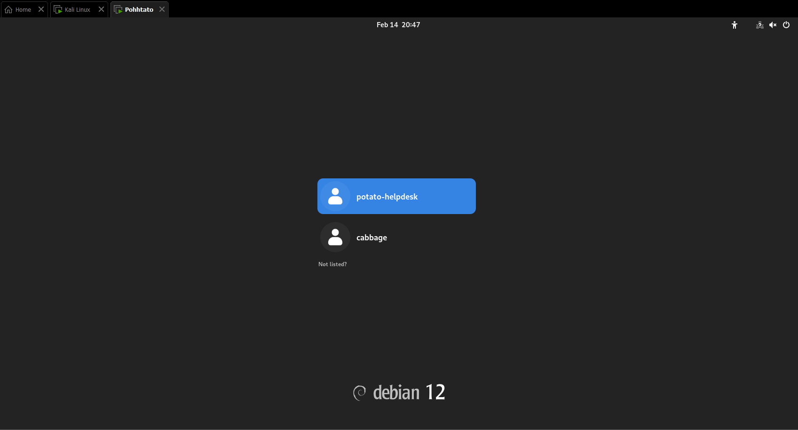

# Pohhtato Virtual Machine (VM) Penetration Testing (PT)

Credits to my seniors at [Custodio Technologies](https://www.custodiotech.com.sg/) who created the VM (Charles & W.L)

VM file link: https://drive.google.com/file/d/

_Note: This is my first time, bare with me please._

I will be using [Kali Linux](https://www.kali.org/) on [VMware Workstation Pro](https://www.vmware.com/products/desktop-hypervisor/workstation-and-fusion) as my Virtualization Software.


## Step 1 (Setting Up)
Ensuring that my [Kali Linux](https://www.kali.org/) (Attacking Machine) & the Pohhtato VM (Target Machine) are on the same network.

## Step 2 (Reconnaissance)
Powering on Pohhtato VM shows us that it is using Debian, and two user accounts are available for usage, **cabbage** & **potato-helpdesk**.



**Cyber Kill Chain = Reconnaissance --> Weaponization --> Delivery --> Exploitation --> Installation --> Command & Control (C2) --> Actions on Objectives**

While I won't be implementing all the steps in the Cyber Kill Chain, I will be following the general flow which first leads us to **RECONNAISSANCE**.

**Goal: Finding all open ports (Attack Vectors), getting as much information as possible.**

I will start by using [Metasploit Framework](https://github.com/rapid7/metasploit-framework) so that I can automatically have the output of my [NMAP](https://github.com/nmap/nmap) scans saved into the database.

1) Creating my Pohhtato Workspace in [Metasploit Framework](https://github.com/rapid7/metasploit-framework) `workspace add Pohhtato`
2) Navigating to my Pohhtato Workspace in [Metasploit Framework](https://github.com/rapid7/metasploit-framework) `workspace Pohhtato`
3) Identifying the IP address of the Pohhtato VM by scanning the network `ip a` followed by `nmap 192.168.233.0/24`, which gave the following result:

   ```
   Nmap scan report for potatos.potato-school.com (192.168.233.135)
   Host is up (0.0011s latency).
   Not shown: 997 filtered tcp ports (no-response)
   PORT    STATE SERVICE
   21/tcp  open  ftp
   80/tcp  open  http
   443/tcp open  https
   MAC Address: 00:0C:29:50:FC:48 (VMware)
   ```
