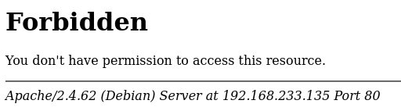
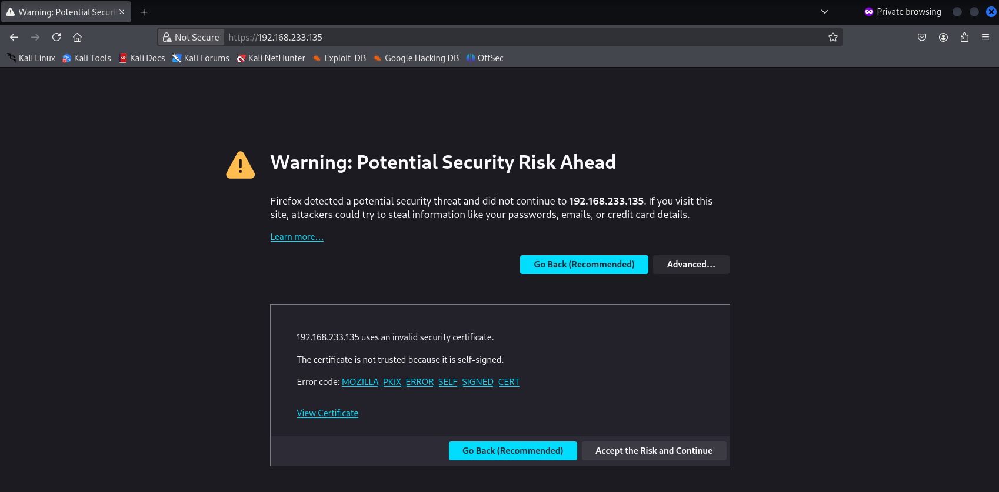
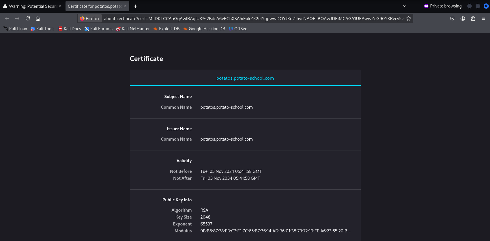
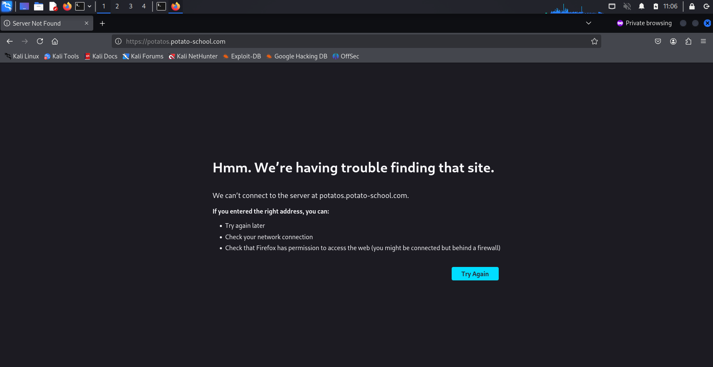
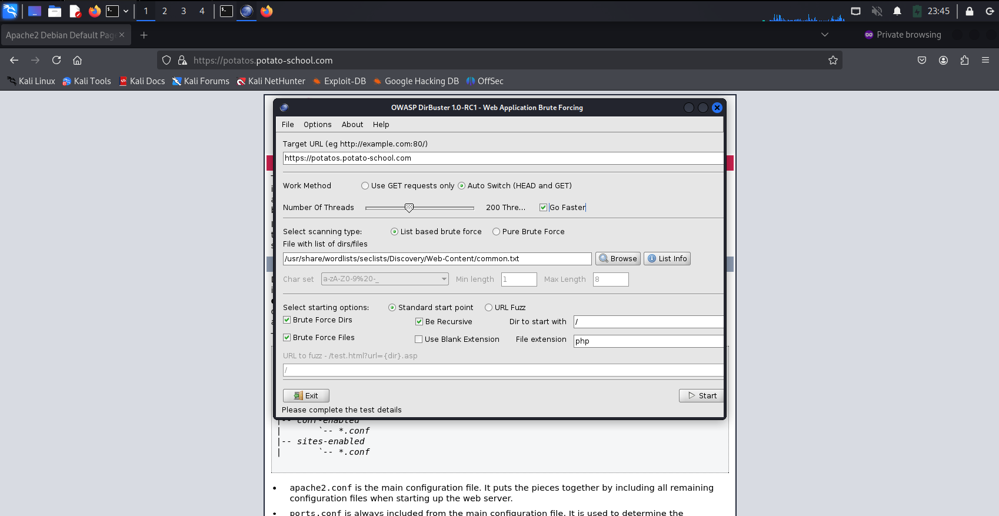
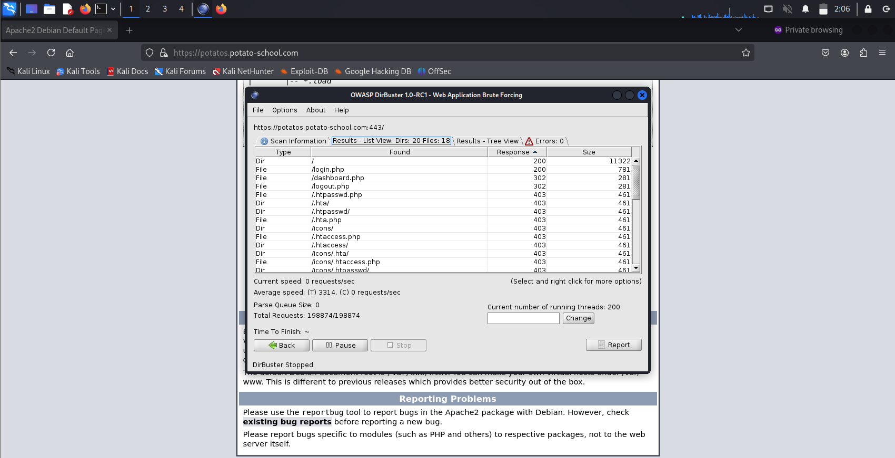
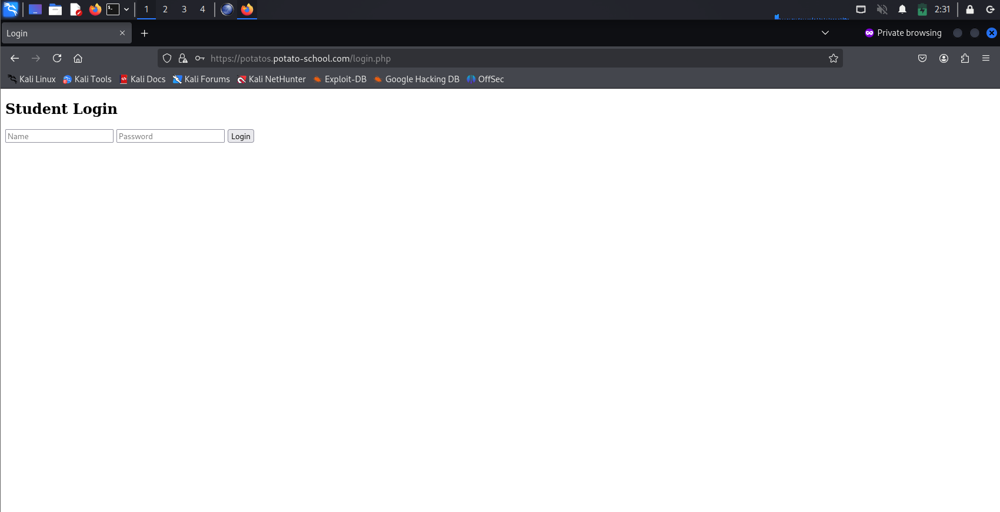
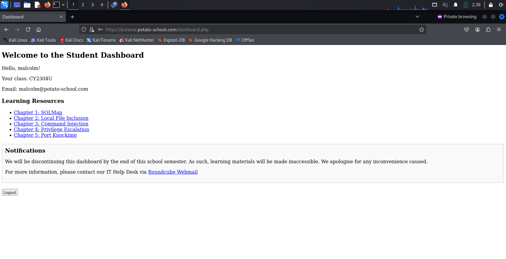

# Pohhtato Virtual Machine (VM) Penetration Testing (PT)

Huge Thanks & Credits to my seniors at [Custodio Technologies](https://www.custodiotech.com.sg/) who created the VM (Charles & W.L)

VM file link: https://drive.google.com/file/d/

_Note: This is my first time, bare with me please._

I will be using [Kali Linux](https://www.kali.org/) on [VMware Workstation Pro](https://www.vmware.com/products/desktop-hypervisor/workstation-and-fusion) as my Virtualization Software.


## Step 1 (Setting Up)
Ensuring that my [Kali Linux](https://www.kali.org/) (Attacking Machine) & the Pohhtato VM (Target Machine) are on the same network.

## Step 2 (Reconnaissance)
Powering on Pohhtato VM shows us that it is using Debian, and two user accounts are available for usage, ***cabbage*** & ***potato-helpdesk***.


***Cyber Kill Chain = Reconnaissance --> Weaponization --> Delivery --> Exploitation --> Installation --> Command & Control (C2) --> Actions on Objectives***

While I won't be implementing all the steps in the Cyber Kill Chain, I will be following the general flow which first leads us to **RECONNAISSANCE**.

**Goal: Finding all open ports (Attack Vectors), gathering as much information as possible.**

I will start by using [Metasploit Framework](https://github.com/rapid7/metasploit-framework) so that I can automatically have the output of my [NMAP](https://github.com/nmap/nmap) scans saved into the database.

1) Creating my Pohhtato Workspace in [Metasploit Framework](https://github.com/rapid7/metasploit-framework) `workspace add Pohhtato`.
2) Navigating to my Pohhtato Workspace in [Metasploit Framework](https://github.com/rapid7/metasploit-framework) `workspace Pohhtato`.
3) Identifying the IP address of the Pohhtato VM by scanning the network `ip a` followed by `nmap 192.168.233.0/24`, which gave the following result:

   ```
   Nmap scan report for potatos.potato-school.com (192.168.233.135)
   Host is up (0.0011s latency).
   Not shown: 998 filtered tcp ports (no-response)
   PORT    STATE SERVICE
   80/tcp  open  http
   443/tcp open  https
   MAC Address: 00:0C:29:50:FC:48 (VMware)
   ```
   
4) Further reconnaissance with [NMAP](https://github.com/nmap/nmap)'s aggressive scan (-A) & [Vulscan](https://github.com/scipag/vulscan)'s NSE script in [Metasploit Framework](https://github.com/rapid7/metasploit-framework) `db_nmap -A --script=vulscan 192.168.233.135`, which gave the following result when accessing it in the database `services`:

   ```
   Services
   ========

   host             port  proto  name      state  info
   ----             ----  -----  ----      -----  ----
   192.168.233.135  80    tcp    http      open   Apache httpd 2.4.62
   192.168.233.135  443   tcp    ssl/http  open   Apache httpd 2.4.62 (Debian)
   ```

5) Checking the output of the scan shows that there aren't any vulnerabilities:

   ```
   [*] Nmap: PORT    STATE SERVICE  REASON         VERSION
   [*] Nmap: 80/tcp  open  http     syn-ack ttl 64 Apache httpd 2.4.62
   [*] Nmap: |_http-server-header: Apache/2.4.62 (Debian)
   [*] Nmap: | /usr/share/nmap/scripts/vulscan: VulDB - https://vuldb.com:
   [*] Nmap: | No findings
   [*] Nmap: | MITRE CVE - https://cve.mitre.org:
   [*] Nmap: | No findings
   [*] Nmap: | SecurityFocus - https://www.securityfocus.com/bid/:
   [*] Nmap: | No findings
   [*] Nmap: | IBM X-Force - https://exchange.xforce.ibmcloud.com:
   [*] Nmap: | No findings
   [*] Nmap: | Exploit-DB - https://www.exploit-db.com:
   [*] Nmap: | No findings
   [*] Nmap: | OpenVAS (Nessus) - http://www.openvas.org:
   [*] Nmap: | No findings
   [*] Nmap: | SecurityTracker - https://www.securitytracker.com:
   [*] Nmap: | No findings
   [*] Nmap: | OSVDB - http://www.osvdb.org:
   [*] Nmap: | No findings
   [*] Nmap: 443/tcp open  ssl/http syn-ack ttl 64 Apache httpd 2.4.62 ((Debian))
   [*] Nmap: |_http-server-header: Apache/2.4.62 (Debian)
   [*] Nmap: | /usr/share/nmap/scripts/vulscan: VulDB - https://vuldb.com:
   [*] Nmap: | No findings
   [*] Nmap: | MITRE CVE - https://cve.mitre.org:
   [*] Nmap: | No findings
   [*] Nmap: | SecurityFocus - https://www.securityfocus.com/bid/:
   [*] Nmap: | No findings
   [*] Nmap: | IBM X-Force - https://exchange.xforce.ibmcloud.com:
   [*] Nmap: | No findings
   [*] Nmap: | Exploit-DB - https://www.exploit-db.com:
   [*] Nmap: | No findings
   [*] Nmap: | OpenVAS (Nessus) - http://www.openvas.org:
   [*] Nmap: | No findings
   [*] Nmap: | SecurityTracker - https://www.securitytracker.com:
   [*] Nmap: | No findings
   [*] Nmap: | OSVDB - http://www.osvdb.org:
   [*] Nmap: | No findings
   ```

6) Since there aren't any vulnerabilities in the output of the scan, I decided to use a web browser ([Mozilla](https://github.com/mozilla)) & access the website of the Pohhtato VM since we saw that both HTTP & HTTPS ports were open alongside the word "Apache", by typing the IP address of the Pohhtato VM in the URL bar `192.168.233.135`:

   

7) Access the website using HTTP doesn't seem to work & it gives the word "Forbidden", which is HTTP response code 403. Since I am unable to access the webpage via HTTP, I decided to add HTTPS:// at the front of the IP address when typing it into the URL bar `https://192.168.233.135`:

   

8) Seeing the Invalid Security Certificate popup reminded me of a task in [TryHackMe Advent of Cyber 2024](https://tryhackme.com/christmas/) regarding Certificate Mismanagement. Further exploration showed that the Common Name & Issuer of the certificate was ***potatos.potato-school.com***. When attempting to access the website ***potatos.potato-school.com***, it failed because the system isn't resolving ***potatos.potato-school.com*** to ***192.168.233.135***. In order to change that, I used the following commands: `sudo su` &`echo "192.168.233.135 potatos.potato-school.com >> /etc/hosts"`, which then allowed me to access the website.

   
   

   ```
   ┌──(ctf)─(kali㉿kali)-[~]
   └─$ sudo su
   ┌──(root㉿kali)-[/home/kali]
   └─# echo "192.168.233.135 potatos.potato-school.com" >> /etc/hosts
   ```

   
   
10) Since the webpage seems to be normal & we knew that only 2 ports were open, I decided to try Directory Brute-forcing using the application [Dirbuster](https://www.kali.org/tools/dirbuster/). First, I filled in the type `https://potatos.potato-school.com` in the _Target URL_ field, ticked the checkbox _Go Faster_, used the wordlist _/usr/share/wordlists/Discovery/Web-Content/common.txt_, and pressed `Start`.

   
   
11) Upon completion of the brute-force, we received the following results when navigating to the `Results - List View: Dirs: XX Files: XX`, we can see the followwing directories & files that gave a HTTP response code of 200: The root directory `/` & the file `/login.php`.

   

12) Since we can see that `/login.php` gave a HTTP response code of 200, I decided to access the page which showed a simple `Student Login` page. Since the webpage showed a simple login page, I decided to use a simple attack method: [SQL Injection](https://owasp.org/www-community/attacks/SQL_Injection), and inserted `' OR 1 = 1 #` into the `Name` field & a random character in the `Password` field.

   

   Successful [SQL Injection](https://owasp.org/www-community/attacks/SQL_Injection) into `Student Login` webpage:
   
   

13) With the successful [SQL Injection](https://owasp.org/www-community/attacks/SQL_Injection), we can see that we are logged in as `Malcolm`, with his personal data such as his class `CY2304U` & email `malcolm@potato-school.com`. Also, we can see various learning resources but are unable to access them (We will keep them in mind for now):

    `Chapter 1: SQL Map`
    `Chapter 2: Local File Inclusion`
    `Chapter 3: Command Injection`
    `Chapter 4: Privilege Escalation`
    `Chapter 5: Port Knocking`

    Lastly, we can see a hyperlink in the webpage `Roundcube Webmail`, which opens a web mail application.

15) 
